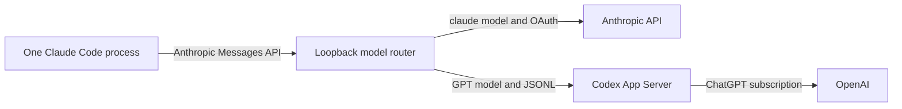

# Claude Code Model Router

**Status**: First edition

**Author**: Laurence Hook

**Companion file**: [bridge-test-matrix.md](bridge-test-matrix.md)

## Purpose

Run one unmodified Claude Code process and choose either Anthropic or GPT models with Claude Code's normal `/model` command.
Claude Code sends every request to one loopback router.
The router selects the provider from the request's `model` field.

## Required behavior

The key words "MUST", "MUST NOT", "SHALL", and "SHALL NOT" are interpreted as described in [BCP 14](https://www.rfc-editor.org/info/bcp14) when they appear in capitals.

- **REQ-001**: The launcher SHALL start one unmodified official Claude Code process with `ANTHROPIC_BASE_URL` set to the loopback router.
- **REQ-002**: The router SHALL proxy Anthropic's available models through `GET /v1/models`, and the launcher SHALL register `gpt-5.6-sol` through Claude Code's supported custom-model setting so both providers appear in `/model`.
- **REQ-003**: A `claude-*` Messages request SHALL be streamed unchanged to `https://api.anthropic.com` with Claude Code's Anthropic OAuth bearer.
- **REQ-004**: The exact configured GPT model SHALL be translated to the official `codex app-server` protocol after `account/read` reports `chatgpt` and `model/list` confirms that model.
- **REQ-005**: The router SHALL make the provider decision independently for every request so one running Claude Code session can change provider after `/model` changes the request model.
- **REQ-006**: The GPT route SHALL carry the Claude system prompt as App Server developer instructions, encode role-bearing conversation history as exact JSON, preserve tools and identifiers, map structured-output schemas to App Server, stream text deltas when requested, and return an Anthropic JSON message for non-stream requests.
- **REQ-006B**: The GPT route SHALL translate every Claude tool name to a provider-safe internal identifier before registering it with App Server, SHALL restore the exact Claude tool name in the returned `tool_use`, and SHALL reject tool calls whose internal identifier was not registered for that turn.
- **REQ-006A**: The GPT route SHALL report exact App Server token usage on completed text turns. It SHALL omit usage on an intermediate tool-use boundary when App Server has not reported usage yet, and SHALL NOT fabricate a value.
- **REQ-007**: The GPT route SHALL enforce `max_tokens` as a conservative UTF-8 byte ceiling, interrupt generation at the ceiling, and return the `max_tokens` stop reason.
- **REQ-008**: Unknown models, invalid authentication, unsupported GPT inputs, provider errors, and protocol errors SHALL fail explicitly without retrying through another model or provider.
- **REQ-009**: A fresh launch-scoped `x-model-rocket-token` SHALL authenticate Claude Code to the router and SHALL be removed before any upstream request.
- **REQ-010**: Tool continuations SHALL be bound to both Claude's session ID and tool-use ID, and abandoned App Server sessions SHALL expire after ten minutes.
- **REQ-011**: The Anthropic OAuth bearer SHALL be sent only to the hardcoded Anthropic API origin and SHALL never enter the Codex request, router environment, or child environment.
- **REQ-012**: The implementation SHALL NOT install a certificate authority, intercept TLS, patch a vendor executable, copy or store a vendor token, accept an Anthropic or OpenAI API key, or call an undocumented provider endpoint.
- **REQ-013**: The router SHALL bind to an automatically selected loopback port, cap request bodies and aggregate non-stream responses at 8 MiB each, reject upstream redirects, and omit credentials and request bodies from logs.
- **REQ-014**: The GPT route SHALL require Codex CLI 0.146.0, run it with an isolated home and only Claude-supplied dynamic tools, cap App Server frames at 8 MiB, and admit at most four active or retained App Server sessions.
- **REQ-015**: The launcher SHALL default the lead Claude Code session to the exact model `claude-fable-5`.
- **REQ-016**: The supplied Claude Code subagent definition SHALL select `gpt-5.6-sol` with `isolation: worktree` so the Fable lead session can delegate isolated implementation tasks through the same router.

## Architecture

Claude Code keeps ownership of its tools, hooks, skills, MCP servers, permissions, transcript, and `/model` interface.
The router only selects a provider and translates the GPT request and response protocol.

## Acceptance

The automated code gate is `just verify-full`.
Product acceptance additionally requires one unmodified Claude Code process to select an Anthropic model, complete a request, select `gpt-5.6-sol`, complete a text and tool request, then select an Anthropic model again.
Provider credentials must remain isolated throughout that sequence.

This is an experimental compatibility layer rather than a vendor-supported cross-subscription integration.
Company security approval and current subscription-term review remain deployment prerequisites.
